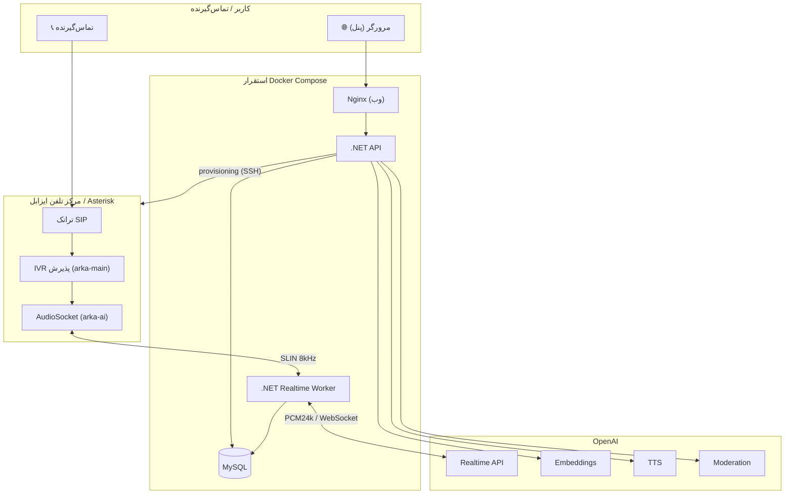

# معماری سامانه — کال سنتر هوشمند آرکا

> مستند معماری سطح‌بالا (High-Level Architecture) برای سامانه‌ی تلفن هوشمند/کال‌سنتر هوشمند آرکا.
> این سند بخشی از مجموعه‌مستندات اپیک **«دموی کال سنتر هوشمند آرکا»** است.

## ۱. نمای کلی

سامانه‌ای چندمستأجری (multi-tenant) است که هر کاربر یک **شماره‌ی داخلی اختصاصی** روی مرکز تلفن ایزابل (Asterisk) می‌گیرد. تماس‌های ورودی به‌صورت بلادرنگ توسط هوش مصنوعی و بر پایه‌ی **پایگاه دانش اختصاصی هر کاربر** (RAG) پاسخ داده می‌شوند.

## ۲. اجزای اصلی

| لایه | فناوری | مسئولیت |
|------|--------|---------|
| فرانت‌اند | React + Vite + TypeScript + Tailwind (RTL) | پنل کاربر و ادمین، ویزارد راه‌اندازی، تور راهنما |
| API | .NET 9 (ASP.NET Core) | احراز هویت، مدیریت پایگاه دانش، provisioning، پنل ادمین |
| Realtime Worker | .NET 9 (Worker) | پل صوتی AudioSocket ↔ OpenAI Realtime |
| داده | MySQL (EF Core + Pomelo) | کاربران، پایگاه دانش، تماس‌ها، تنظیمات، مصرف توکن |
| هوش مصنوعی | OpenAI (Realtime, Embeddings, TTS) + Moderation | پاسخ صوتی، نمایه‌سازی RAG، پالایش محتوا |
| تلفنی | Isabel/Asterisk (AudioSocket, PJSIP) | مرکز تلفن، شماره‌های داخلی، ترانک، مسیر خروجی |

## ۳. دیاگرام معماری

## ۴. جریان یک تماس ورودی

1. تماس‌گیرنده شماره‌ی داخلی را می‌گیرد؛ Asterisk تماس را به context `arka-ai` می‌برد.
2. dialplan یک UUID می‌سازد که **شماره‌ی داخلی** و **شماره‌ی تماس‌گیرنده** را کد می‌کند و با `AudioSocket` به Realtime Worker وصل می‌شود.
3. Worker شماره‌ی داخلی را استخراج و کاربر/پایگاه دانش را از دیتابیس می‌خواند.
4. Worker به OpenAI Realtime متصل می‌شود، دستورها (شاملِ پایگاه دانش و میزانِ پایبندی) و صدا را می‌فرستد.
5. پاسخِ صوتیِ هوش مصنوعی به Asterisk بازگردانده و برای تماس‌گیرنده پخش می‌شود.
6. رونوشتِ مکالمه، سوالاتِ بی‌پاسخ، فایلِ ضبط و مصرفِ توکن ثبت می‌شوند.

## ۵. پروتکل AudioSocket و کدگذاری UUID

- هر پیام: `[۱ بایت نوع][۲ بایت طول][payload]`؛ صدا SLIN (PCM16، ۸kHz، mono).
- **۱۲ رقم آخرِ UUID** = شماره‌ی داخلیِ صفرپرشده (worker با آن کاربر را می‌شناسد).
- **۲۰ رقم اولِ UUID** = «۱ + شماره‌ی تماس‌گیرنده»ِ صفرپرشده؛ رقمِ نگهبانِ «۱» تضمین می‌کند صفرِ ابتداییِ موبایل (۰۹xx) حفظ شود.

## ۶. اصول امنیت و جداسازی مستأجرها

- همه‌ی مسیرهای API با `[Authorize]` و بر پایه‌ی `UserId` توکن محدود می‌شوند؛ هیچ کاربری به داده‌ی کاربر دیگر دسترسی ندارد.
- مسیرهای مدیریتی با `[Authorize(Roles = "SuperAdmin")]`.
- کاربرِ غیرفعال (`IsActive=false`) نه لاگین می‌کند و نه خطش پاسخ می‌دهد.
- اسرار (کلید OpenAI، توکن پیامک، رمز ایزابل) هرگز در مخزن نیستند؛ فقط در `.env`.
