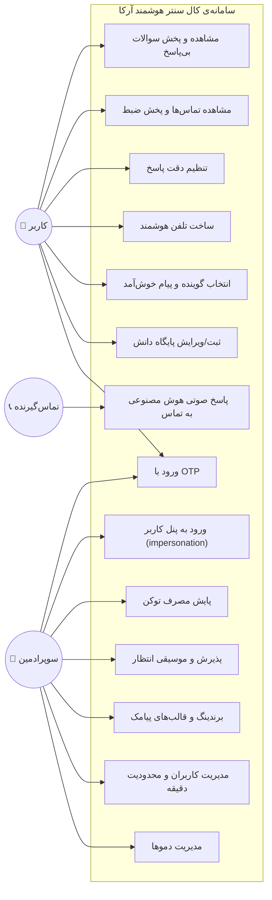

# نمودار Use Case — کال سنتر هوشمند آرکا

> بازیگران سامانه و موارد کاربردِ اصلی.

## بازیگران (Actors)

| بازیگر | توضیح |
|--------|-------|
| **تماس‌گیرنده** | فردی که با شماره‌ی داخلیِ هوشمند تماس می‌گیرد (کاربر نهاییِ نامشخص). |
| **کاربر** | صاحبِ کسب‌وکار که پایگاه دانش می‌سازد و تلفن هوشمند دریافت می‌کند. |
| **سوپرادمین** | مدیر سامانه؛ تنظیمات کلی، دموها، کاربران، برندینگ و پایش. |
| **سامانه‌ی هوش مصنوعی** | OpenAI (Realtime/Embeddings/TTS/Moderation) به‌عنوان بازیگرِ بیرونی. |
| **مرکز تلفن** | ایزابل/Asterisk به‌عنوان بازیگرِ بیرونی. |

## نمودار Use Case

## شرح موارد کاربردیِ کلیدی

### UC8 — پاسخ صوتی هوش مصنوعی به تماس
- **پیش‌شرط:** تلفن هوشمندِ فعال + پایگاه دانشِ تأییدشده + عدم اتمامِ سقفِ دقیقه + کاربرِ فعال.
- **جریان:** پخش پیام خوش‌آمد → دریافت سوال → پاسخ از پایگاه دانش؛ در نبودِ پاسخ، پخشِ پیامِ fallback و ثبتِ «سوالِ بی‌پاسخ».
- **پس‌شرط:** ثبتِ رونوشت، ضبط، مصرفِ دقیقه و توکن.

### UC7 — مشاهده و پخش سوالات بی‌پاسخ
- کاربر فهرستِ سوالاتی را که پاسخشان در پایگاه دانش نبوده می‌بیند و هرکدام را به‌صورت صوتی (TTS) می‌شنود تا پایگاه دانش را کامل‌تر کند.

### UC5 — تنظیم دقت پاسخ
- کاربر با یک اسلایدرِ ۱۰ تا ۱۰۰٪ تعیین می‌کند پاسخ‌ها چقدر به پایگاه دانش پایبند باشند (بالاتر = دقیق‌تر و محتاط‌تر). این کنترل از طریقِ دستورهای مدل (پرامپت) اعمال می‌شود.
