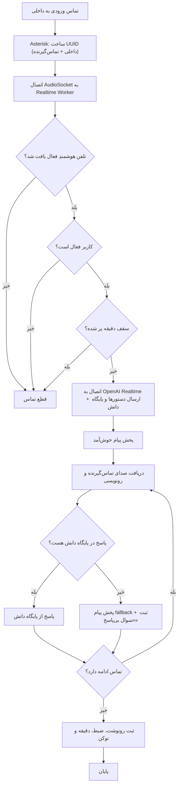
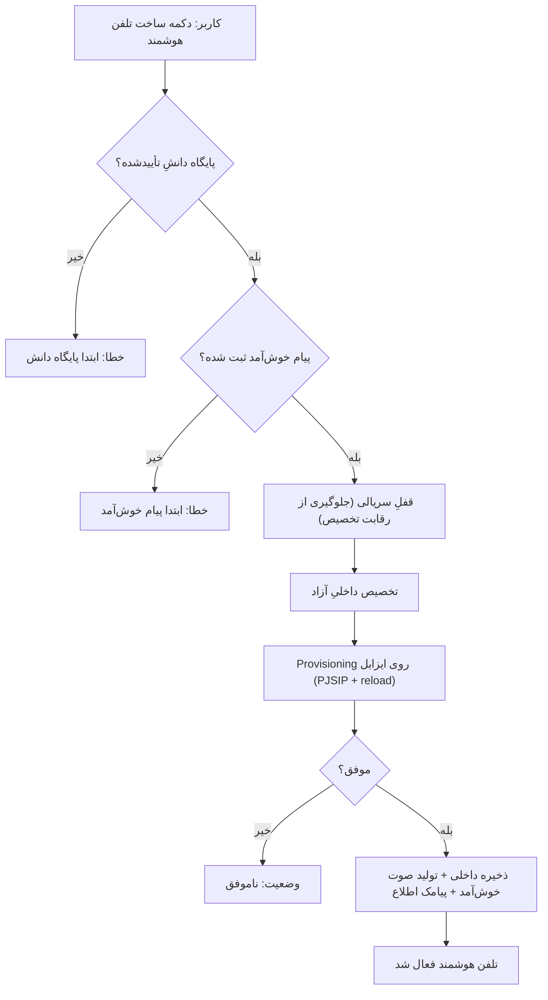
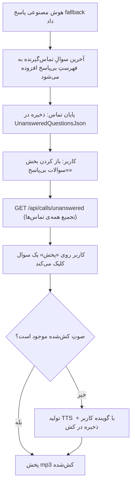
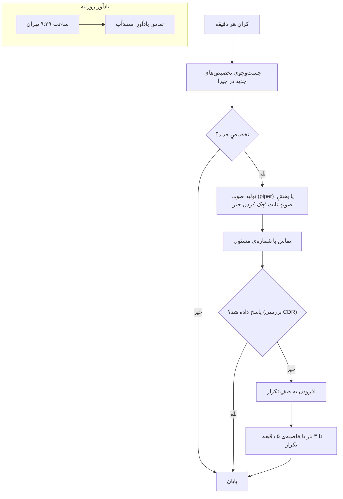
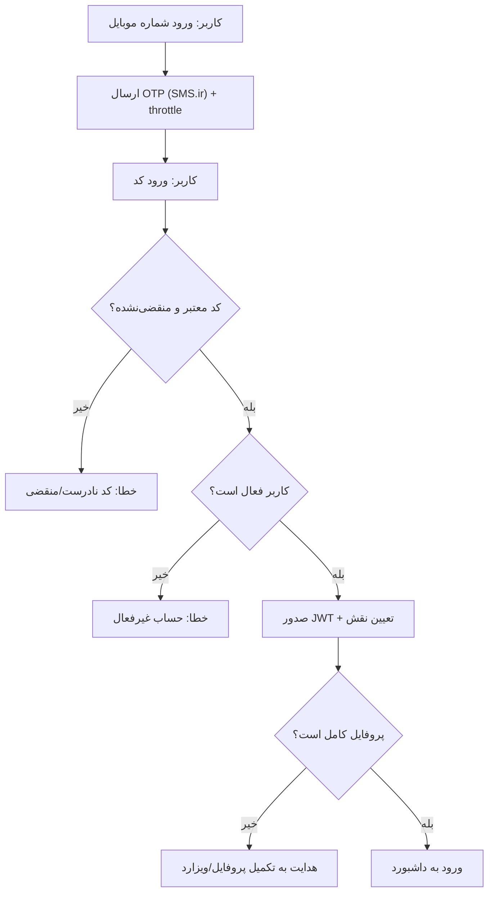

# نمودارهای Activity — کال سنتر هوشمند آرکا

> جریان‌های کاریِ اصلیِ سامانه به‌صورت نمودار فعالیت (Activity Diagram).

## ۱. جریان تماس ورودی و پاسخ هوش مصنوعی

## ۲. ساخت تلفن هوشمند (Provisioning)

## ۳. ثبت و پخش سوالات بی‌پاسخ

## ۴. اتوماسیون اطلاع‌رسانی صوتی جیرا

## ۵. احراز هویت با OTP

