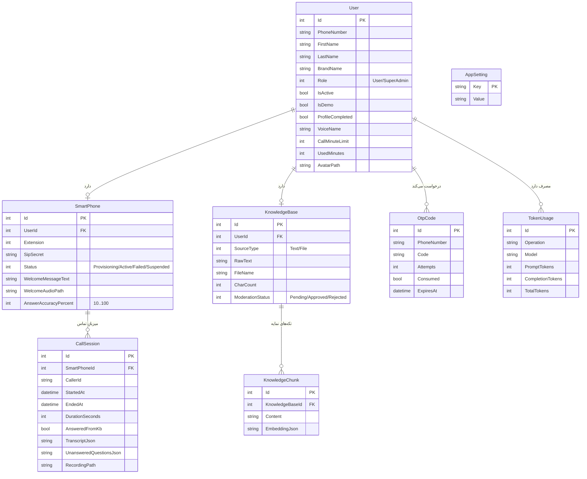

# مدل داده (ERD) — کال سنتر هوشمند آرکا

> موجودیت‌های اصلی دیتابیس و روابط آن‌ها (EF Core + MySQL).

## نکات کلیدی

- **AnswerAccuracyPercent** روی `SmartPhone`: پیش‌فرض ۷۰؛ کنترلِ پایبندی به پایگاه دانش از طریق پرامپت.
- **UnansweredQuestionsJson** روی `CallSession`: آرایه‌ی JSON از سوالاتی که پاسخشان در پایگاه دانش نبوده.
- **AppSetting**: تنظیماتِ سراسری (کلیدها/مدل‌های OpenAI، پیامِ fallback، گوینده‌ی پیش‌فرض، سقفِ دقیقه، موسیقی انتظار، ...)؛ اسرار با ماسک نمایش داده و هنگام ذخیره بازنویسی نمی‌شوند.
- **جداسازی مستأجرها:** همه‌ی پرس‌وجوها با `UserId` محدود می‌شوند.
