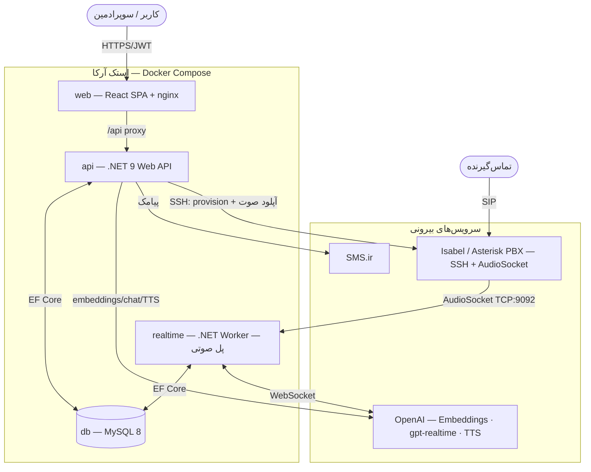
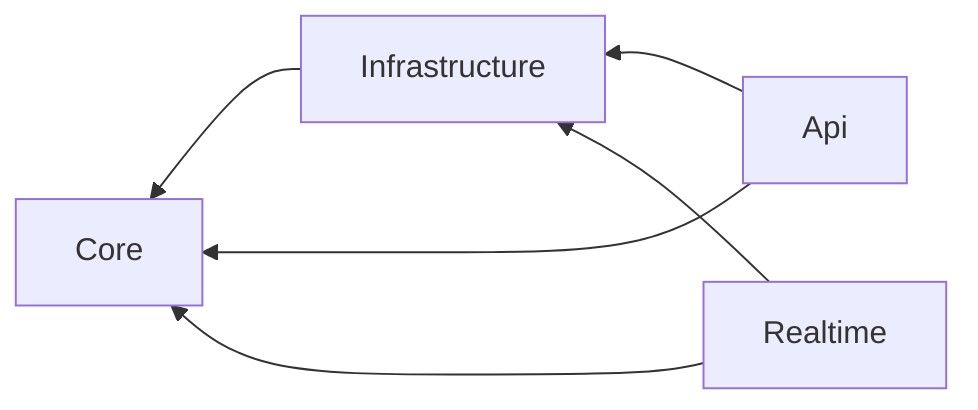
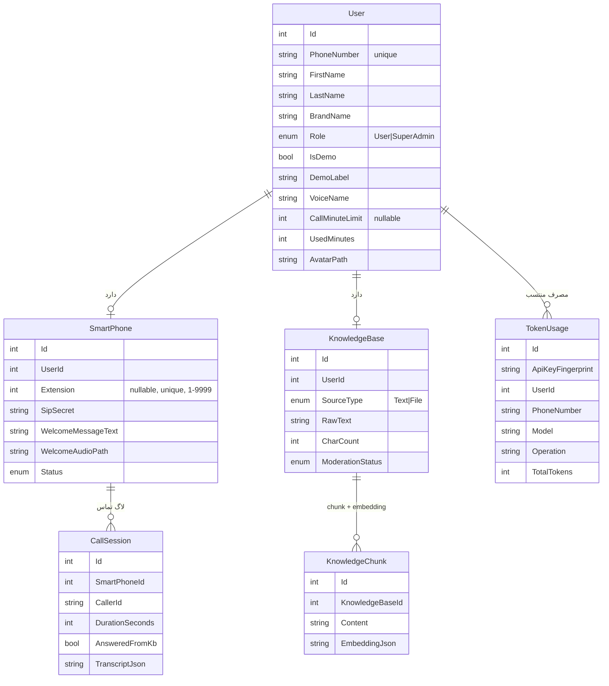
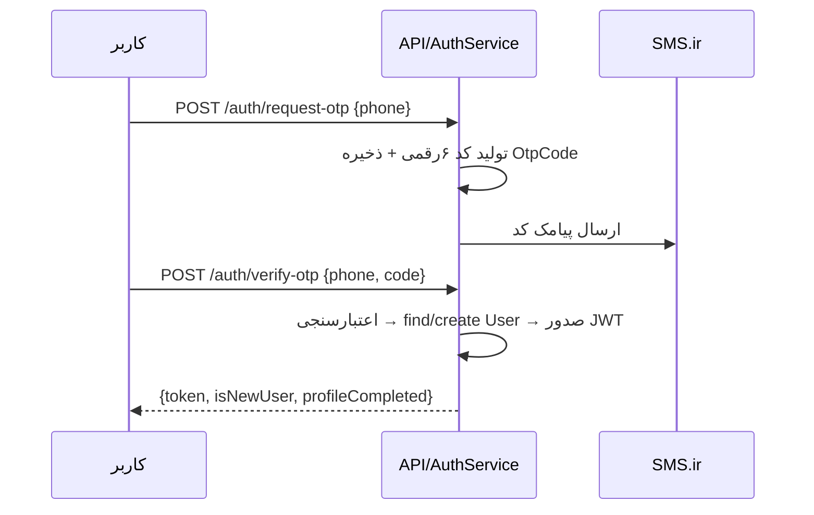
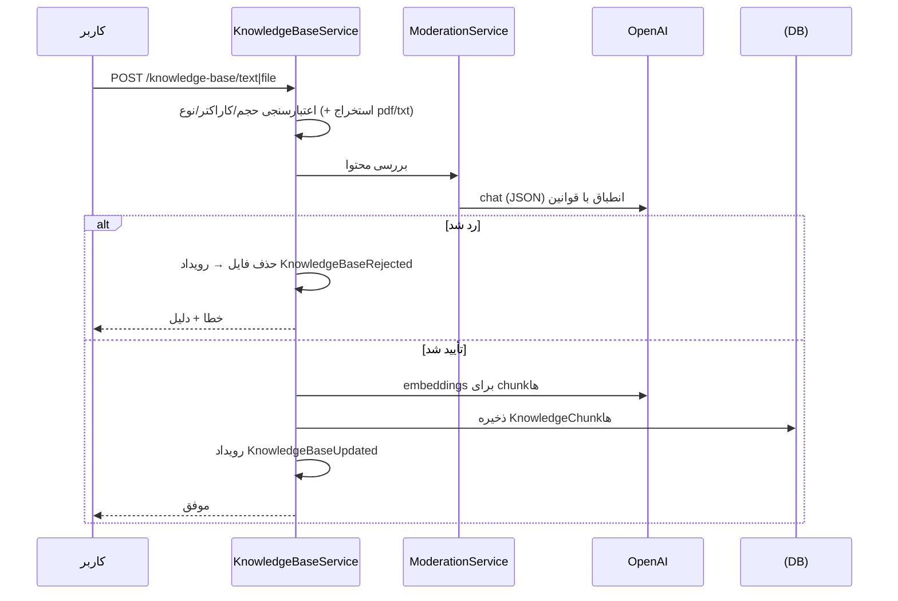
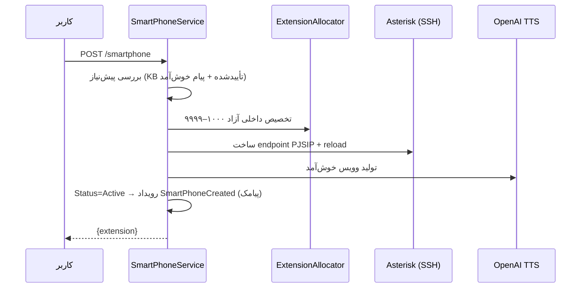
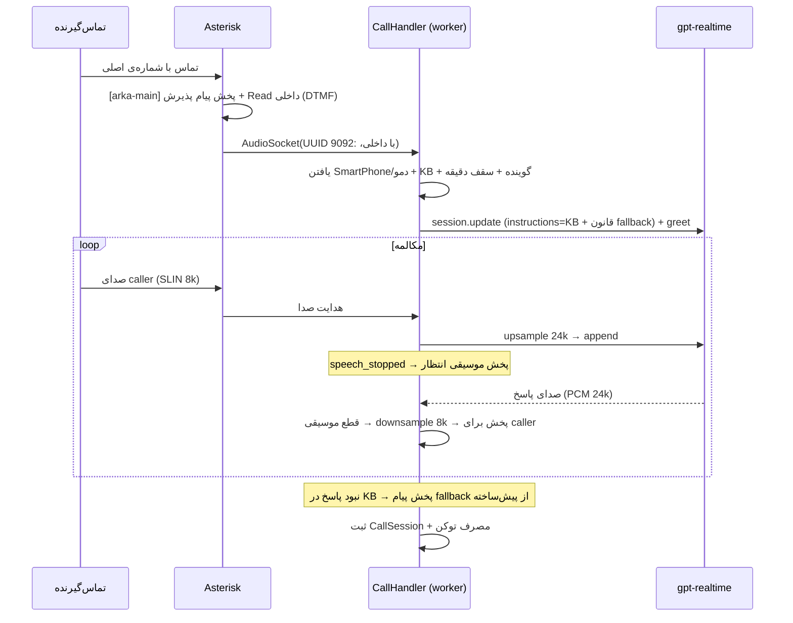
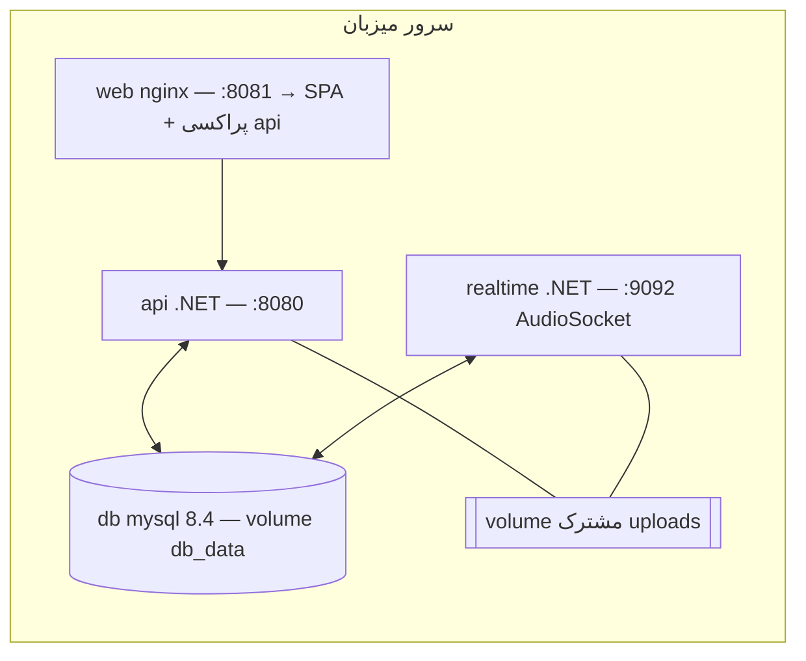

# سند معماری — Arka Call Center

> سامانه‌ی تلفن هوشمند چند-مستأجری مبتنی بر هوش مصنوعی.
> این سند تصویر کامل معماری سیستم را ارائه می‌دهد. برای وضعیت فازها و قراردادهای توسعه به [`../CLAUDE.md`](../CLAUDE.md) و برای جزئیات تلفنی به [`../telephony/README.md`](../telephony/README.md) مراجعه کنید.

نمودارها با Mermaid رسم شده‌اند و روی GitHub رندر می‌شوند.

---

## ۱. هدف و دامنه

هر «کاربر» (صاحب کسب‌وکار) یک **تلفن هوشمند** دریافت می‌کند: یک داخلی روی سرور ایزابل (Asterisk) که تماس‌های ورودی را با **OpenAI gpt-realtime** و بر پایه‌ی **پایگاه دانش اختصاصی همان کاربر (RAG)** پاسخ می‌دهد.

سه نقش:
- **User** — لاگین با موبایل، مدیریت پایگاه دانش، پیام خوش‌آمد، گوینده، پروفایل.
- **SuperAdmin** — تنظیمات سراسری، دموها، برندینگ، پیام پذیرش، گزارش مصرف.
- **Caller** — تماس‌گیرنده‌ی نهایی که با هوش مصنوعی صحبت می‌کند (نقش نرم‌افزاری ندارد).

---

## ۲. تصمیمات کلیدی معماری

| # | تصمیم | دلیل |
|---|-------|------|
| 1 | **Clean Architecture** سه‌لایه (Api / Core / Infrastructure) + worker مجزا | جداسازی دامنه از زیرساخت، تست‌پذیری، جایگزینی آسان سرویس‌های خارجی |
| 2 | **AudioSocket** به‌جای ARI/RTP برای پل صوتی | پروتکل ساده‌تر (TCP + SLIN)، بدون نیاز به مدیریت RTP |
| 3 | **تنظیمات حساس در DB (`AppSetting`) نه در کد** | سوپرادمین کلیدها را از پنل مدیریت می‌کند؛ اسرار در گیت نیست |
| 4 | **دمو = User با `IsDemo`** (داخلی ۱–۹۹۹) | بازاستفاده‌ی کامل منطق تماس/RAG بدون کد تکراری |
| 5 | **RAG درون‌حافظه‌ای (cosine)** به‌جای vector DB | حجم پایگاه دانش کوچک است (≤۲۰۰۰ کاراکتر / ۱۰۰KB) |
| 6 | **پیام‌های ثابت (fallback/پذیرش) از پیش‌ساخته با TTS** | صرفه‌جویی در مصرف توکن realtime |
| 7 | **استقرار با Docker Compose** | راه‌اندازی یک‌دستوری کل استک |

---

## ۳. نمای کلان (System Context + Container)



نگاشت پورت‌ها (پیش‌فرض): وب `8081` · API `8080` · AudioSocket `9092` · MySQL داخلی `3306`.

---

## ۴. استک فناوری

| لایه | فناوری |
|------|--------|
| Frontend | React 18 · Vite · TypeScript · Tailwind CSS v4 · Vazirmatn (RTL) · lucide-react · React Query · React Router |
| Backend | .NET 9 · ASP.NET Core Web API · Clean Architecture |
| ORM / DB | EF Core 9 · Pomelo.MySql · **MySQL 8** |
| AI | OpenAI Embeddings (`text-embedding-3-small`) · `gpt-realtime` · TTS (`gpt-4o-mini-tts`) |
| SMS | SMS.ir REST v1 |
| Telephony | Asterisk (Isabel) · AudioSocket · SSH.NET (provisioning + SCP) |
| صوت | PdfPig (استخراج متن) · resampler خطی ۸k↔۲۴k · WAV/SLIN داخلی |
| Deploy | Docker · Docker Compose · nginx |

---

## ۵. ساختار کد

```
ArkaCallCenterDemo/
├── backend/
│   ├── ArkaCallCenter.sln
│   └── src/
│       ├── ArkaCallCenter.Core            # موجودیت‌ها، enumها، abstractionها، ثابت‌ها (بدون وابستگی خارجی)
│       ├── ArkaCallCenter.Infrastructure  # EF/MySQL، سرویس‌های خارجی، صوت، seeder، migrations
│       ├── ArkaCallCenter.Api             # کنترلرها، JWT، میدل‌ور، Swagger، DI
│       └── ArkaCallCenter.Realtime        # worker پل صوتی (AudioSocket ⇄ realtime)
├── frontend/                              # React SPA
├── telephony/                             # dialplan، pjsip، راهنمای ایزابل
├── docs/                                  # همین سند + استقرار + تلفنی
├── docker-compose.yml
└── CLAUDE.md
```

### لایه‌بندی بک‌اند (وابستگی‌ها به سمت داخل)



`Core` هیچ وابستگی خارجی ندارد؛ همه‌ی interfaceها آنجا تعریف و در `Infrastructure` پیاده‌سازی می‌شوند.

---

## ۶. مدل دامنه (ERD)



موجودیت‌های پیکربندی (بدون رابطه‌ی مستقیم): `AppSetting` (key/value تنظیمات، حساس‌ها ماسک)، `SmsTemplate` (قالب هر رویداد)، `SmsEventRecipient` (مقصد هر رویداد)، `VoiceOption` (گوینده‌ها + نمونه‌صدا)، `OtpCode`.

**بازه‌ی داخلی‌ها:** کاربران `۱۰۰۰–۹۹۹۹` · دموها `۱–۹۹۹` (تخصیص در `ExtensionAllocator`).

---

## ۷. مؤلفه‌های سرویس (Infrastructure)

| سرویس | مسئولیت |
|-------|---------|
| `AuthService` | OTP ورود، صدور JWT، تکمیل پروفایل، **تغییر شماره با OTP** |
| `SettingsService` | خواندن/نوشتن `AppSetting` با fallback به env؛ ماسک اسرار |
| `TokenService` | صدور JWT |
| `OpenAiService` | embeddings / chat / TTS (creds از تنظیمات) + **ثبت مصرف توکن** |
| `ModerationService` | بررسی انطباق با قوانین ج.ا. (fail-closed) |
| `RagService` | chunking + embedding + بازیابی cosine با آستانه |
| `FileTextExtractor` | استخراج متن از txt/pdf (PdfPig) |
| `KnowledgeBaseService` | ارکستراسیون KB: اعتبارسنجی، moderation، حذف فایل مغایر، index، رویداد |
| `ExtensionAllocator` | تخصیص داخلی یکتا (کاربر ۱۰۰۰–۹۹۹۹ / دمو ۱–۹۹۹) |
| `AsteriskProvisioningService` | ساخت داخلی (PJSIP via SSH) + **آپلود صوت (SCP)** |
| `SmartPhoneService` | پیش‌نیازها، تخصیص، provision، وویس خوش‌آمد، پیامک |
| `DemoService` | CRUD دموها (سوپرادمین) |
| `SmsIrSender` | ارسال پیامک SMS.ir (fallback لاگ در نبود کلید) |
| `SmsEventDispatcher` | رندر قالب + ارسال به مقصدها (کاربر و/یا لیست ثابت) |
| `TokenUsageTracker` + `UsageContext` | ثبت مصرف توکن منتسب به کاربر جاری |
| `AudioConvert` | PCM→WAV۸k · WAV→SLIN۸k · resample |

**worker (`ArkaCallCenter.Realtime`):** `AudioSocketServer` (TCP) → `CallHandler` (منطق هر تماس) → `OpenAiRealtimeClient` (WebSocket) + `AudioResampler` + `AudioSocketProtocol`.

---

## ۸. جریان‌های کلیدی

### ۸.۱ ورود با OTP



تغییر شماره مشابه است اما کد به **شماره‌ی جدید** ارسال می‌شود و پس از تأیید، `User.PhoneNumber` به‌روزرسانی می‌گردد.

### ۸.۲ پایگاه دانش + RAG + Moderation



### ۸.۳ ساخت تلفن هوشمند



### ۸.۴ پاسخ‌گویی تماس (IVR پذیرش + realtime + موسیقی انتظار)



### ۸.۵ موتور رویداد → پیامک

هر رویداد یک قالب (`SmsTemplate`) و مجموعه مقصد (`SmsEventRecipient`) دارد. مقصدها **مستقل‌اند**: می‌توان همزمان به «خودِ کاربر» **و** «لیست شماره‌های ثابت» ارسال کرد، یا فقط یکی، یا با غیرفعال‌کردن رویداد به هیچ‌کس. رویدادها:
`OtpRequested`, `UserRegistered`, `SmartPhoneCreated`, `KnowledgeBaseRejected`, `KnowledgeBaseUpdated`, `CallLimitNearlyReached`, `CallLimitReached`, `NewCallReceived`, `SystemAlert`.

### ۸.۶ رهگیری مصرف توکن

`UsageContextMiddleware` هویت کاربر را از JWT در `IUsageContext` (scoped) می‌گذارد. `OpenAiService` پس از هر فراخوانی، مصرف را با `ITokenUsageTracker` ثبت می‌کند (به‌همراه اثرانگشت ماسک‌شده‌ی کلید API). worker مصرف realtime را در پایان تماس ثبت می‌کند. گزارش‌ها: به تفکیک **کلید API** (با تاریخ شمسی) و **کاربر/موبایل**.

---

## ۹. مدل چند-مستأجری و دموها

- هر کاربر یک tenant است؛ داده‌ها با `UserId` جدا می‌شوند.
- **دمو** یک `User` با `IsDemo=true` و داخلی ۱–۹۹۹ است که سوپرادمین می‌سازد و کنترل می‌کند (پیام خوش‌آمد، KB، گوینده، محدودیت). چون از همان موجودیت‌ها استفاده می‌کند، منطق RAG و پاسخ‌گویی بدون تغییر روی دموها هم کار می‌کند. تعداد دموها نامحدود است.

---

## ۱۰. مدیریت رسانه و فایل‌ها

فایل‌ها در volume مشترک `uploads` ذخیره می‌شوند (mount روی `api` و `realtime`).

| رسانه | تولید/آپلود | مصرف |
|-------|-------------|------|
| وویس خوش‌آمد | TTS هنگام ساخت تلفن | (realtime آن را با متن می‌گوید) |
| پیام fallback | TTS در پنل | worker |
| پیام پذیرش (IVR) | TTS → WAV۸k → SCP به ایزابل | dialplan |
| موسیقی انتظار | آپلود WAV → SLIN۸k | worker (استریم SLIN) |
| نمونه‌صدای گوینده | TTS یا آپلود mp3 | تگ audio (کاربر) |
| آواتار کاربر | آپلود تصویر | تگ img (`/api/avatars/{id}`) |
| لوگوی سامانه | آپلود (سوپرادمین) | تگ img (`/api/branding/logo`) |
| ویدیوی آموزشی | آپلود mp4/webm | تگ video (استریم range) |

استریم رسانه‌های عمومی (آواتار/لوگو/ویدیو/نمونه‌صدا) **ناشناس** است چون تگ‌های img/audio/video هدر Authorization نمی‌فرستند و محتوا حساس نیست.

---

## ۱۱. امنیت

- **احراز هویت:** JWT (Bearer) با نقش‌های `User`/`SuperAdmin`؛ endpointهای ادمین با `[Authorize(Roles="SuperAdmin")]`.
- **اسرار:** کلید OpenAI، توکن SMS.ir، رمز SSH ایزابل، JWT secret هرگز در گیت نیستند؛ در `.env`/`AppSetting` (ماسک در پاسخ API).
- **ورودی:** محدودیت حجم/نوع فایل‌ها؛ moderation محتوای پایگاه دانش (fail-closed).
- **تلفن:** رمز SIP تصادفی برای هر داخلی.

---

## ۱۲. معماری استقرار (Docker Compose)



- API هنگام بالا آمدن **migration خودکار** می‌زند و seed می‌کند.
- متغیرها از `.env` (کنار compose) خوانده می‌شوند. جزئیات در [`DEPLOYMENT.md`](./DEPLOYMENT.md).

---

## ۱۳. سطح API (خلاصه)

```
# احراز هویت
POST /api/auth/request-otp | verify-otp | profile
# کاربر
GET  /api/me ; PUT /api/me/voice
POST /api/me/phone/request-change | confirm-change
POST/DELETE /api/me/avatar
# پایگاه دانش و تلفن
GET/POST/DELETE /api/knowledge-base(/text|/file)
GET/POST/PUT    /api/smartphone(/welcome)
GET  /api/voices ; GET /api/voices/{name}/sample
GET  /api/calls
# رسانه (ناشناس)
GET  /api/avatars/{id} ; /api/branding/logo(+/info) ; /api/tutorial-video(+/info)
# سوپرادمین
GET/PUT  /api/admin/settings | sms-templates | sms-events | voices | fallback-message
POST     /api/admin/voices/{name}/sample-generate|sample-file
GET/PUT  /api/admin/main-greeting ; POST /api/admin/hold-music ; PUT hold-music/enabled
GET/POST/PUT/DELETE /api/admin/demos
POST/DELETE /api/admin/logo | tutorial-video
GET      /api/admin/usage/keys | usage/users ; PUT /api/admin/users/{id}/limit
```

مستندات تعاملی: `‍/swagger` (در محیط Development).

---

## ۱۴. نگاشت نیازمندی → مؤلفه

| نیازمندی | مؤلفه |
|----------|-------|
| لاگین موبایل / تغییر شماره | `AuthService` + SMS.ir |
| پایگاه دانش (متن/فایل) | `KnowledgeBaseService` + `FileTextExtractor` |
| RAG | `RagService` (embeddings + cosine) |
| بررسی قوانین ج.ا. | `ModerationService` |
| تخصیص داخلی | `ExtensionAllocator` |
| ساخت تلفن روی ایزابل | `AsteriskProvisioningService` + `SmartPhoneService` |
| پاسخ‌گویی realtime | `ArkaCallCenter.Realtime` |
| IVR پذیرش + دریافت داخلی | dialplan `[arka-main]` + پیام پذیرش (TTS) |
| موسیقی انتظار | worker + `AudioConvert` |
| پیام fallback (صرفه‌جویی توکن) | `AppSetting` + TTS از پیش‌ساخته |
| انتخاب/نمونه‌ی گوینده | `VoiceOption` + `VoiceSampleButton` |
| پیامک رویدادها | `SmsEventDispatcher` |
| دموها ۱–۹۹۹ | `DemoService` |
| گزارش مصرف توکن | `TokenUsageTracker` + گزارش‌های ادمین |
| برندینگ/آواتار | `MediaController` + `AppSetting`/`User.AvatarPath` |
| تنظیمات سوپرادمین | `AdminController` + `AppSetting` |

---

## ۱۵. نقاط توسعه‌ی آینده

- جایگزینی RAG درون‌حافظه‌ای با vector store در صورت بزرگ‌شدن پایگاه دانش.
- barge-in واقعی (قطع پاسخ AI هنگام صحبت caller).
- پخش fallback به‌صورت فایل کاملاً ضبط‌شده (به‌جای گفتن متن توسط مدل) برای صرفه‌جویی بیشتر.
- صف/مقیاس‌پذیری worker برای تماس‌های همزمان بالا.
- کش توکن OpenAI و مانیتورینگ/آلارم مصرف.
